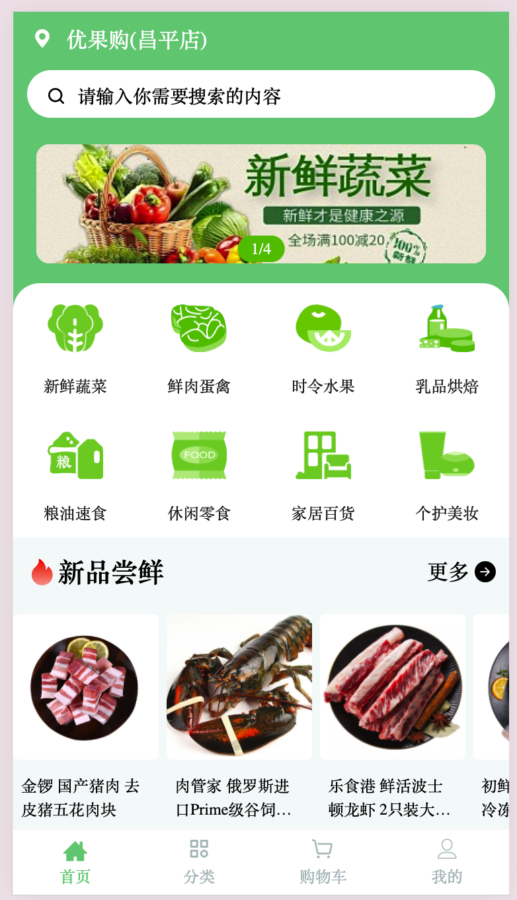
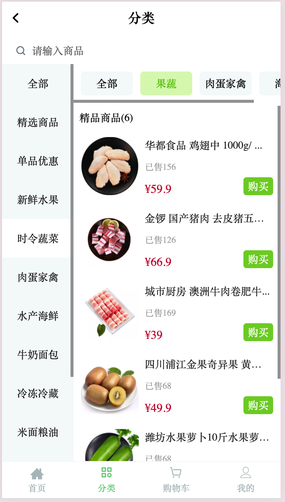

## project snapshot




## project setup

1. npm i

2. use proxyman or charles maplocal request to local file
/hotsearch hostsearch.json
/login login.json
/home home.json
/register register.json
3. using proxy tool to intercept requst 

``script
//cors resolve
  response.headers["Access-Control-Allow-Origin"] = "*";
  response.headers["Access-Control-Allow-Headers"] = "Origin, Content-Type, X-Auth-Token, token"
  response.headers["Access-Control-Allow-Methods"] = "GET,HEAD,POST"
```
npm run start