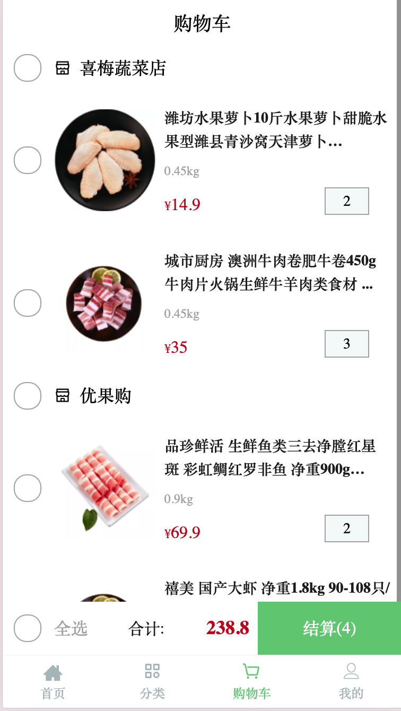

## project snapshot



## project setup

1. npm i

2. 用本地代理(proxyman | charles) maplocal功能
Mock folder: 所有请求映射到本地的文件
3. 记得写拦截请求处理跨域问题
``script
//cors resolve
  response.headers["Access-Control-Allow-Origin"] = "*";
  response.headers["Access-Control-Allow-Headers"] = "Origin, Content-Type, X-Auth-Token, token"
  response.headers["Access-Control-Allow-Methods"] = "GET,HEAD,POST"
```
npm run start